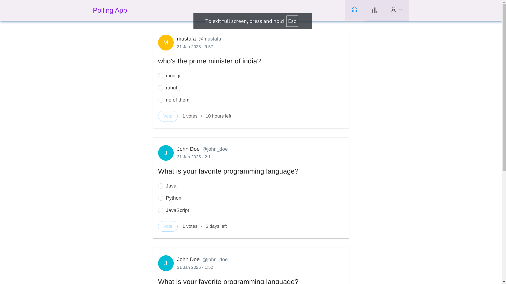
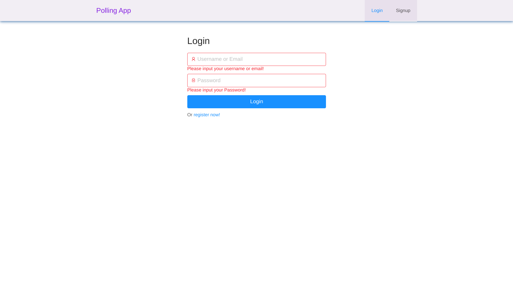
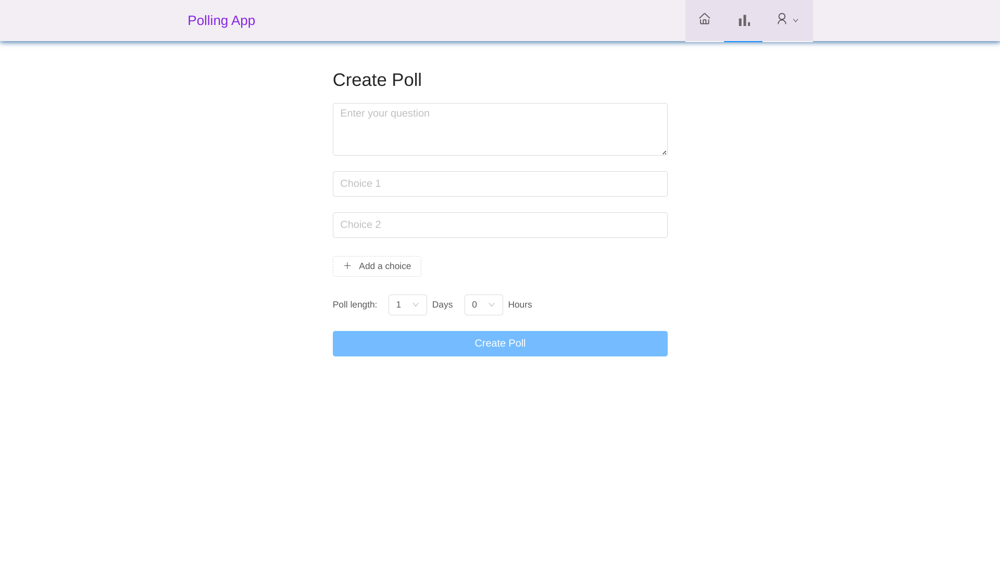
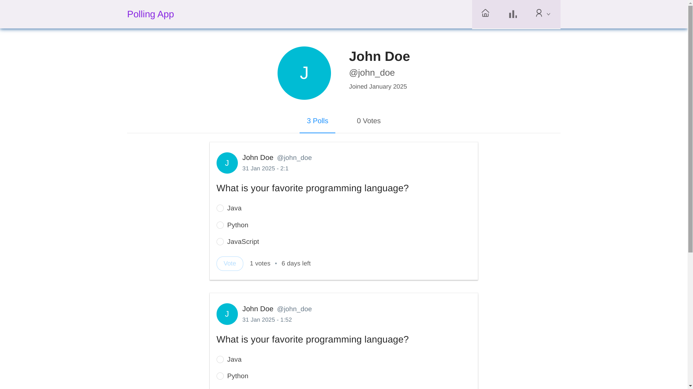
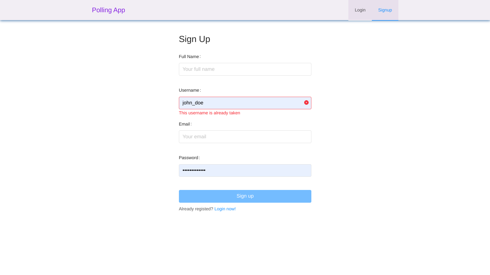

# Full-Stack Polling Application

A comprehensive polling application with a React frontend and Spring Boot backend, allowing users to create, vote on, and manage polls.



<div style="display: grid; grid-template-columns: repeat(2, 1fr); gap: 10px; margin: 20px 0;">
    <div style="text-align: center;">
        
        <p><em>Login Screen</em></p>
    </div>
    <div style="text-align: center;">
        
        <p><em>Create Poll</em></p>
    </div>
    <div style="text-align: center;">
        
        <p><em>profile Screen</em></p>
    </div>
    <div style="text-align: center;">
        
        <p><em>signup Dashboard</em></p>
    </div>
</div>

A comprehensive polling application with a React frontend and Spring Boot backend, allowing users to create, vote on, and manage polls.

This project consists of two main components:

1. A React-based frontend (`polling-app-client`) that provides a user interface for interacting with polls.
2. A Spring Boot backend (`polling-app-server`) that handles data persistence, authentication, and business logic.

The application allows users to create accounts, log in, create polls, vote on polls, and view poll results. It uses JSON Web Tokens (JWT) for authentication and implements RESTful API endpoints for communication between the frontend and backend.

## Repository Structure

```
.
├── polling-app-client/
│   ├── public/
│   ├── src/
│   │   ├── app/
│   │   ├── common/
│   │   ├── constants/
│   │   ├── poll/
│   │   ├── user/
│   │   └── util/
│   ├── config-overrides.js
│   ├── Dockerfile
│   └── package.json
└── polling-app-server/
    ├── src/
    │   └── main/
    │       ├── java/
    │       │   └── com/
    │       │       └── example/
    │       │           └── polls/
    │       │               ├── config/
    │       │               ├── controller/
    │       │               ├── exception/
    │       │               ├── model/
    │       │               ├── payload/
    │       │               ├── repository/
    │       │               ├── security/
    │       │               ├── service/
    │       │               └── util/
    │       └── resources/
    ├── Dockerfile
    └── pom.xml
```

### Key Files

- `polling-app-client/src/app/App.js`: Main React component
- `polling-app-client/src/util/APIUtils.js`: API utility functions for frontend
- `polling-app-server/src/main/java/com/example/polls/PollsApplication.java`: Spring Boot application entry point
- `polling-app-server/src/main/java/com/example/polls/config/SecurityConfig.java`: Security configuration
- `polling-app-server/src/main/java/com/example/polls/controller/`: API controllers
- `polling-app-server/src/main/resources/application.yml`: Server configuration

## Usage Instructions

### Prerequisites

- Node.js 18.x or later
- Java Development Kit (JDK) 17 or later
- Maven 3.8.x or later
- MySQL 8.x or later

### Installation

1. Clone the repository:
   ```
   git clone <repository-url>
   cd <repository-name>
   ```

2. Set up the backend:
   ```
   cd polling-app-server
   mvn clean install
   ```

3. Set up the frontend:
   ```
   cd ../polling-app-client
   npm install
   ```

4. Configure the database:
   - Create a MySQL database for the application
   - Update the `polling-app-server/src/main/resources/application.yml` file with your database credentials

### Running the Application

1. Start the backend server:
   ```
   cd polling-app-server
   mvn spring-boot:run
   ```

2. Start the frontend development server:
   ```
   cd polling-app-client
   npm start
   ```

3. Access the application at `http://localhost:3000`

### Configuration

- Backend configuration: `polling-app-server/src/main/resources/application.yml`
- Frontend API base URL: `polling-app-client/src/constants/index.js`

### Testing

- Backend tests:
  ```
  cd polling-app-server
  mvn test
  ```

- Frontend tests:
  ```
  cd polling-app-client
  npm test
  ```

### Troubleshooting

1. Issue: Backend server fails to start
   - Check if MySQL is running and the database credentials are correct in `application.yml`
   - Ensure the specified database exists
   - Verify that the required ports (default: 8080) are not in use

2. Issue: Frontend fails to connect to the backend
   - Confirm that the backend server is running
   - Check if the API base URL in `polling-app-client/src/constants/index.js` matches the backend server address

3. Issue: JWT token issues
   - Verify that the JWT secret in `application.yml` is set correctly
   - Check if the token expiration time is appropriate for your use case

### Performance Optimization

- Use pagination for poll lists to improve load times for large datasets
- Implement caching mechanisms in the backend for frequently accessed data
- Optimize database queries and indexes for better performance

## Data Flow

The polling application follows a typical client-server architecture with RESTful API communication. Here's an overview of the data flow:

1. User interacts with the React frontend
2. Frontend makes API calls to the backend using axios
3. Backend receives requests through Spring MVC controllers
4. Controllers delegate to services for business logic
5. Services interact with repositories for data persistence
6. Repositories communicate with the MySQL database
7. Results flow back through the layers to the frontend
8. Frontend updates the UI based on the received data

```
[User] <-> [React Frontend] <-> [Spring Boot Backend] <-> [MySQL Database]
```

## Deployment

### Prerequisites

- Docker
- Docker Compose (optional, for local deployment)

### Deployment Steps

1. Build the Docker images:
   ```
   docker build -t polling-app-client ./polling-app-client
   docker build -t polling-app-server ./polling-app-server
   ```

2. Create a `docker-compose.yml` file in the root directory:
   ```yaml
   version: '3'
   services:
     frontend:
       image: polling-app-client
       ports:
         - "80:80"
       depends_on:
         - backend
     backend:
       image: polling-app-server
       ports:
         - "8080:8080"
       environment:
         - SPRING_DATASOURCE_URL=jdbc:mysql://db:3306/polls
         - SPRING_DATASOURCE_USERNAME=<your-db-username>
         - SPRING_DATASOURCE_PASSWORD=<your-db-password>
       depends_on:
         - db
     db:
       image: mysql:8
       environment:
         - MYSQL_DATABASE=polls
         - MYSQL_USER=<your-db-username>
         - MYSQL_PASSWORD=<your-db-password>
         - MYSQL_ROOT_PASSWORD=<your-root-password>
   ```

3. Start the application:
   ```
   docker-compose up -d
   ```

4. Access the application at `http://localhost`

### Environment Configurations

- Set appropriate environment variables for production deployment, including:
  - Database connection details
  - JWT secret
  - CORS allowed origins
  - Logging levels# Polling-Application
